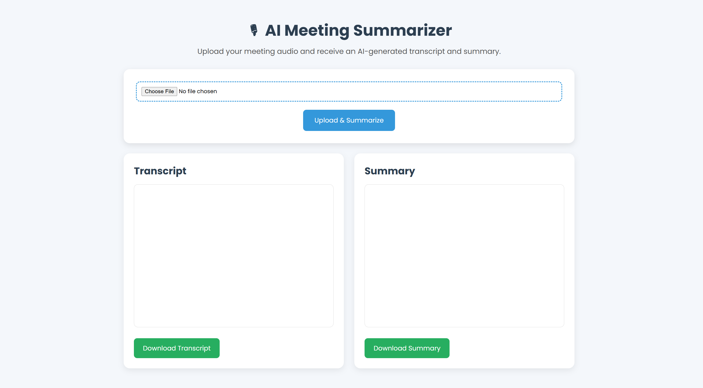
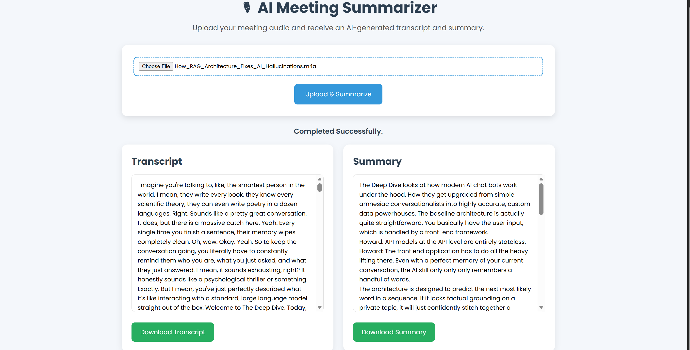

# 🎙️ AI Meeting Summarizer

An AI-powered web application that automatically transcribes meeting audio and generates concise summaries using state-of-the-art Natural Language Processing models.

## 🚀 Features

- 🎧 Upload meeting audio files
- 📝 Automatic speech-to-text transcription using OpenAI Whisper
- 📄 AI-generated meeting summaries using Facebook BART
- 🌐 Simple and responsive web interface
- 📥 Download transcript and summary
- 🐳 Dockerized for easy deployment

---

## 🛠️ Tech Stack

### Backend
- Python
- Flask

### AI Models
- OpenAI Whisper (Speech-to-Text)
- Hugging Face Transformers
- Facebook BART Large CNN

### Frontend
- HTML
- CSS
- JavaScript

### Deployment
- Docker

---

## 📂 Project Structure

```
AI-Meeting-Summarizer/
│
├── app.py
├── requirements.txt
├── Dockerfile
├── README.md
│
├── templates/
│   └── index.html
│
├── static/
│   ├── css/
│   └── js/
│
├── uploads/
├── outputs/
│
├── transcribe.py
├── summarizer.py
└── utils.py
```

---

## ⚙️ Installation

### 1. Clone the Repository

```bash
git clone https://github.com/AnishIIITsonipat2024/AI-Meeting-Summarizer-.git

cd AI-Meeting-Summarizer-
```

### 2. Create Virtual Environment

Windows

```bash
python -m venv venv

venv\Scripts\activate
```

Linux/Mac

```bash
python3 -m venv venv

source venv/bin/activate
```

### 3. Install Dependencies

```bash
pip install -r requirements.txt
```

---

## ▶️ Run the Application

```bash
python app.py
```

Open your browser

```
http://127.0.0.1:5000
```

---

# 🐳 Docker

## Build Docker Image

```bash
docker build -t ai-meeting-summarizer .
```

## Run Docker Container

```bash
docker run -p 5000:5000 ai-meeting-summarizer
```

Open

```
http://localhost:5000
```

---

## 📌 Workflow

1. Upload an audio recording
2. Whisper transcribes the speech
3. BART generates a concise summary
4. View and download the transcript and summary

---

## 📷 Application Preview

> Add screenshots here.

Example:

```
screenshots/
    home.png
    output.png
```

Then include

```md



```

---

## 📦 Requirements

- Python 3.10+
- Flask
- Transformers
- Torch
- OpenAI Whisper
- FFmpeg
- Docker

---

## Future Improvements

- Speaker diarization
- Meeting action item extraction
- Keyword extraction
- Multi-language transcription
- PDF report generation
- Cloud deployment (Render/AWS)

---

## 👨‍💻 Author

**Anish**

B.Tech CSE, IIIT Sonipat

GitHub:
https://github.com/AnishIIITsonipat2024

---

## 📄 License

This project is licensed under the MIT License.
